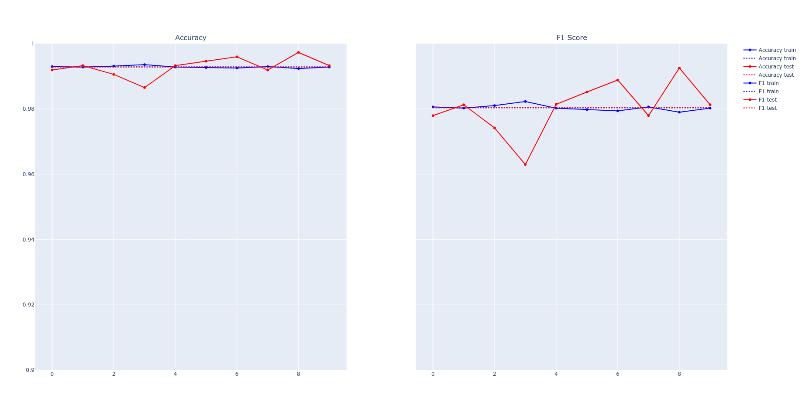
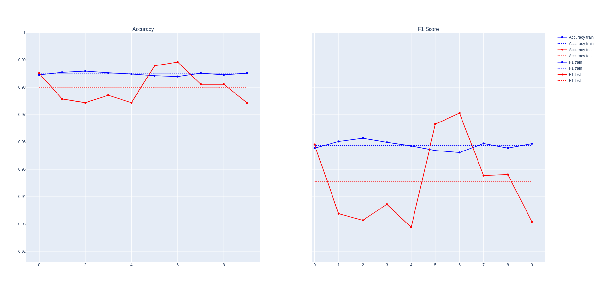

# Górnicy Carla Friedricha Team
> WhyR-Hackathon-2021 submission repository

## Table of contents
* [General info](#general-info)
* [Best solution](#best-solution)
* [Other approaches](#other-approaches)
* [Contact](#contact)

## General info

> Academic papers are not cited by every researcher in proper format, for academic search engines it is problematic to find citations per each paper. As papers are cited in different formats, also with some typos, matching citations with the title of the papers is a complicated task.

The Why R? 2021 Hackathon Challenge is about matching name of academic papers in different format.
Our solution will be scored based on accuracy & F1 of our predictions and based on the creativity of our solution.

## Best solution
The solution, which was chosen as our final solution uses fuzzy text matching. This method
is not a typical Machine Learning solution, but after the analysis of the data and Cross Validation results, we found it
to be both highly accurate and the most stable approach.

We used Python library called FuzzyWuzzy ([link](https://github.com/seatgeek/fuzzywuzzy)). It uses Levenshtein Distance
 to calculate the differences between sequences and takes care of string preprocessing: tokenization, matching texts
 of different lenght and with different order of tokens. The function, which achieves all of those preprocessing steps
 is called `token_set_ratio`. It was used in our final solution. Instead of just tokenizing the strings, sorting and
  then pasting the tokens back together, `token_set_ratio` performs a set operation that takes out the common tokens
  (the intersection) and then makes pairwise comparisons between the following new strings:
  * s1 = Sorted_tokens_in_intersection
  * s2 = Sorted_tokens_in_intersection + sorted_rest_of_str1_tokens
  * s3 = Sorted_tokens_in_intersection + sorted_rest_of_str2_tokens
This approach gave the best results in 10-fold Cross-Validation, thus it was chosen as final approach. Accuracy and 
F1 score metrics for optimal threshold are shown below:

The average Cross-Validation values for accuracy and F1 measure metrics:

    |          | Train | Test  |
    |:--------:|:-----:|:-----:|
    | Accuracy | 0.992 | 0.993 |
    | F1 Score | 0.98  | 0.98  |
#### Preprocessing steps
Basic preprocessing steps included encoding latin characters, removing stopwords and changing text to lowercase.
 During data analysis, we saw that values from columns `authors`, `venue` and `year` are sometimes missing. In those
cases their values were present in `title` column. FuzzyWuzzy package sorts alphabetically tokens, so we could 
concatenate the values from all columns into the `title` column without worrying about their order. Moreover we unified
values from `venue` column to match them between `tableA` and `tableB`.

#### Fuzzy matching
After preparing the dataset, the similarity scores were calculated using `token_set_ratio` function from FuzzyWuzzy 
Python package. Then we subtracted the value of the score based on two assumptions:
* `venue` values must be the same. Otherwise we subtracted the value of 50;
* `year` values must be equal. Otherwise we subtracted the value of 50.
If the assumptions were fulfilled, the score value stayed unchanged. 

## Other approaches

### Logistic regression with hand-crafted features
We used eleven hand-crafted features in this approach. The first eight of them were designed to measure the distance between the two strings.
We decided to use the following string metrics:
 * **Jaccard distance** is defined to be the number of all common terms divided by the sum of all terms,
 * **Damerau-Levenshtein distance**  is given by the normalized number of primary operations that have to be applied to a pair for strings to transform one of them into another,
 * **Jaro-Winkler distance**  is based on the difference of character histograms of two strings and the number of transpositions required to match those histograms. 
 Furthermore, Jaro-Winkler distance attaches higher importance to the prefixes.
 * **QGram distance**  is based on counting the number of the occurrences of different q-grams in the two strings
 
Those metrics were used to compare the titles and authors of both articles. 

The next two features were created by the comparison of the year of creation. The first of them checke if they were identical, whereas the second contained the opposite information. 
They seem to be redundant. However, they could be both false when at least one of the articles did not have an assigned year.

The last variable checked whether both articles came from the same venue.

Careful preparation of the data appeared to be crucial for high scores. We closely analyze the title to extract and fill in the missing data.

At the last step, we trained **logistic regression**. We achieved **99.16%** of accuracy on 10-fold cross-validation. 
Logistic regression is not a sophisticated machine learning algorithm. Therefore, we tried more complex models as well.
We used **T**ree-based **P**ipeline **O**ptimization **T**ool for this purpose. **TPOT** proposed more than a thousand models.
The best accuracy we were able to get was about **99.32%**. We rejected them because of much higher train accuracy, which may have been caused by overfitting.

### Doc2Vec + Metric learning / Classification approach

In this approach we wanted to try vector representation approach mixed up with metric learning / classification on 
embbeded space.

#### Data preprocessing

Our data preprocessing was a very crucial part of the whole task and changes in this step a few times during 
competitions significantly improved the obtained results. In this approach it consisted of the following steps:

* Character coding 
* Value mapping to proper formats
* Simple matching venue categories
* Punctuation cleaning
* Changing text to lowercase
* Concatenation of title, authors, venue, year
* Tokenization

#### Doc2Vec

Then we've prepared Doc2Vec model which was responsible for embedding information about documents.

We've tested many different hyperparameters set-up and finally we've used Distributed-Bag-of-words version of the model
with vector size equal 100. Moreover we've decided on window equal 9 which should cover whole texts as on average texts 
had around 18 tokens. There was no limit for minimal number of token occurrences. Also we haven't used negative sampling
as the results have threatened.

#### Metric Learning / Classification

Finally, in order to give final predictions whether two documents are the same article we've tested many different 
approaches, namely:
* Cosine similarity on vector representation of text pairs
* Shallow metric learning algorithms on vector representation of text pairs
* SVM and other shallow ML classification models on sum / difference / concatenation between (of) vector 
representations of text pairs

The final best model was SVM (RBF kernel + C = 1) on vector differences with the following results obtained on
10 Fold Stratified Cross Validation.

Averaged results:

|          | Train | Test  |
|:--------:|:-----:|:-----:|
| Accuracy | 0.985 | 0.98  |
| F1 Score | 0.96  | 0.945 |

Detailed results:

## Contact
Created by [Łukasz Łaszczuk](https://www.linkedin.com/in/%C5%82ukasz-%C5%82aszczuk-141361187/), [Robert Benke](https://www.linkedin.com/in/robert-benke-396b56175/) and [Patryk Wielopolski](https://www.linkedin.com/in/patryk-wielopolski/) - feel free to contact us!
