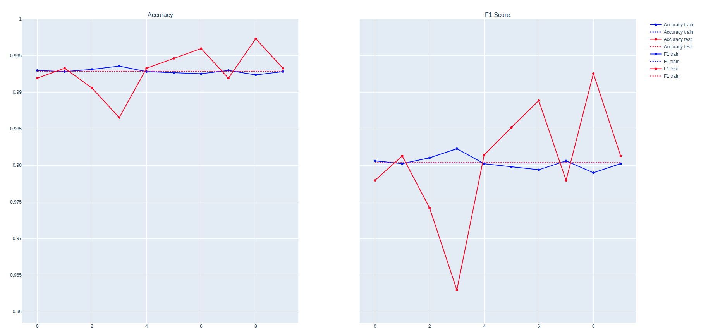

# Górnicy Carla Friedricha Team
> WhyR-Hackathon-2021 submission repository

## Table of contents
* [General info](#general-info)
* [Metrics](#metrics)
* [Best solution](#best-solution)
* [Other approaches](#another-approaches)
* [Contact](#contact)

## General info
Details about the hackathon - something about data etc
Maybe it is the right place for the cv and acc/f1 explanation as well.

## Metrics

## Our solution
Here should be the description of the model we chose.
#### Preprocessing steps

#### Model training

## Other approaches

### Logistic regression with hand-crafted features
We used eleven hand-crafted features in this approach. The first eight of them were designed to measure the distance between the two strings.
We decided to use the following string metrics:
 * **Jaccard distance** is defined to be the number of all common terms divided by the sum of all terms,
 * **Damerau-Levenshtein distance**  is given by the normalized number of primary operations that have to be applied to a pair for strings to transform one of them into another,
 * **Jaro-Winkler distance**  is based on the difference of character histograms of two strings and the number of transpositions required to match those histograms. 
 Furthermore, Jaro-Winkler distance attaches higher importance to the prefixes.
 * **QGram distance**  is based on counting the number of the occurrences of different q-grams in the two strings
 
Those metrics were used to compare the titles and authors of both articles. 

The next two features were created by the comparison of the year of creation. The first of them checke if they were identical, whereas the second contained the opposite information. 
They seem to be redundant. However, they could be both false when at least one of the articles did not have an assigned year.

The last variable checked whether both articles came from the same venue.

Careful preparation of the data appeared to be crucial for high scores. We closely analyze the title to extract and fill in the missing data.

At the last step, we trained **logistic regression**. We achieved **99.16%** of accuracy on 10-fold cross-validation. 
Logistic regression is not a sophisticated machine learning algorithm. Therefore, we tried more complex models as well.
We used **T**ree-based **P**ipeline **O**ptimization **T**ool for this purpose. **TPOT** proposed more than a thousand models.
The best accuracy we were able to get was about **99.32%**. We rejected them because of much higher train accuracy, which may have been caused by overfitting.

### Doc2Vec + Metric learning / Classification approach

In this approach we wanted to try vector representation approach mixed up with metric learning / classification on 
embbeded space.

#### Data preprocessing

Our data preprocessing was a very crucial part of the whole task and changes in this step a few times during 
competitions significantly improved the obtained results. In this approach it consisted of the following steps:

* Character coding 
* Value mapping to proper formats
* Simple matching venue categories
* Punctuation cleaning
* Changing text to lowercase
* Concatenation of title, authors, venue, year
* Tokenization

#### Doc2Vec

Then we've prepared Doc2Vec model which was responsible for embedding information about documents.

We've tested many different hyperparameters set-up and finally we've used Distributed-Bag-of-words version of the model
with vector size equal 100. Moreover we've decided on window equal 9 which should cover whole texts as on average texts 
had around 18 tokens. There was no limit for minimal number of token occurrences. Also we haven't used negative sampling
as the results have threatened.

#### Metric Learning / Classification

Finally, in order to give final predictions whether two documents are the same article we've tested many different 
approaches, namely:
* Cosine similarity on vector representation of text pairs
* Shallow metric learning algorithms on vector representation of text pairs
* SVM and other shallow ML classification models on sum / difference / concatentation between (of) vector 
representations of text pairs

The final best model was SVM (RBF kernel + C = 1) on vector differences.

## Contact
Created by Łukasz Łaszczuk(???@gmail.com), Robert Benke(<robert.benke2@gmail.com>) and Patryk Wielopolski (https://www.linkedin.com/in/patryk-wielopolski/)- feel free to contact us!
